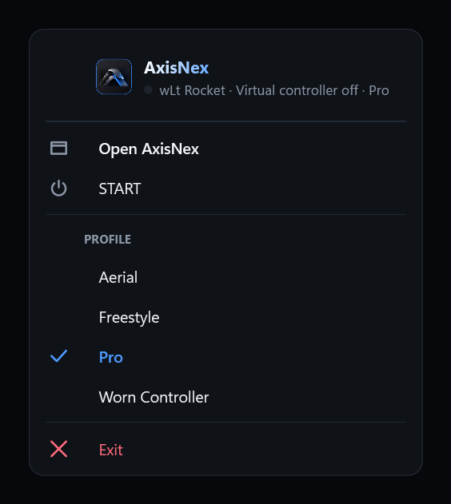
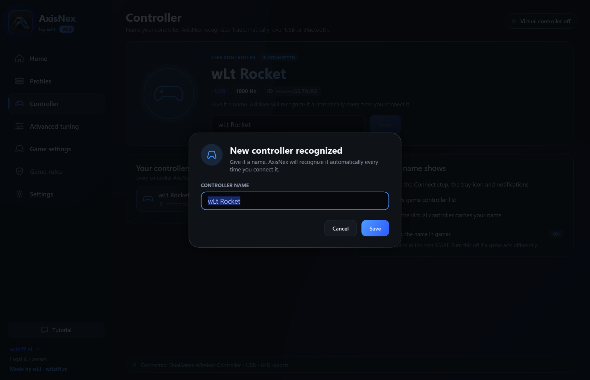
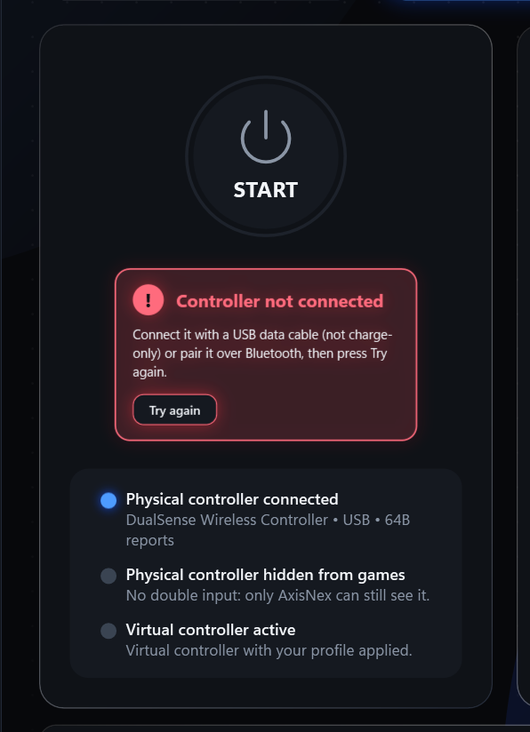
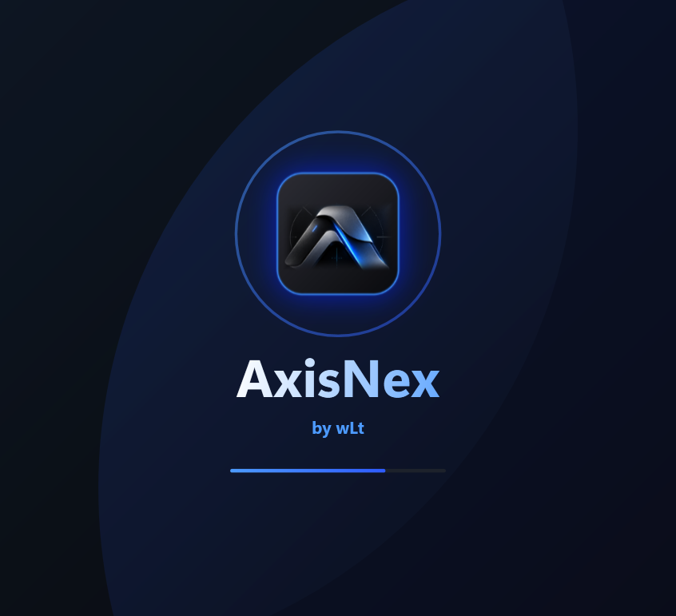
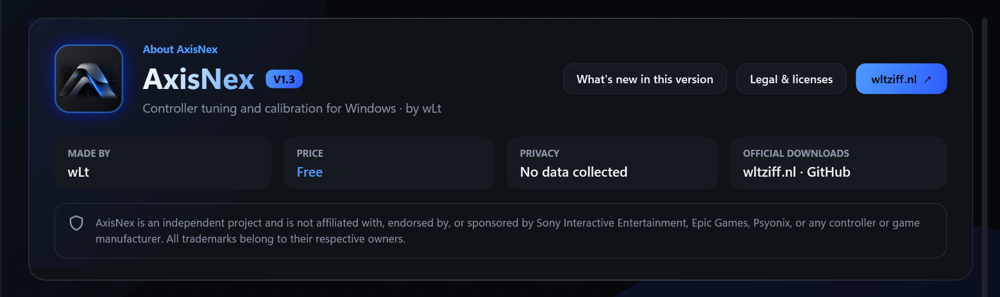

# Changelog

Everything that changed in each version of AxisNex. Newest first.
Download the latest version from [Releases](https://github.com/wlt1920/AxisNex/releases/latest).

## V1.3.0 — 2026-10-08

The biggest update so far: your own profiles, a page for your controller, live before/after previews, and AxisNex now keeps running in the background when you close the window.

### Your own profiles, and sharing them

- New **Profiles** page in the side menu. Every profile has its own card with a small picture of its deadzones and response curve, so you can see at a glance how they differ.
- **New profile** saves the values you are using right now under a new name. You can also **duplicate**, **rename** and **delete** profiles. The four built-in ones can't be deleted, only restored to their original values.
- **Export** saves a profile as an `.axisnex` file. Send it to a friend or keep it as a backup. **Import** reads it back, or just drag the file onto the page.
- Imported files can't break anything: every value is kept within what the sliders allow, and nothing is ever overwritten (a name that's taken becomes "Pro (2)").
- Your calibration is **not** exported. It belongs to your controller, not to the profile.

### ✕ keeps AxisNex running

- Closing the window with **✕** now hides AxisNex next to the clock. Your controller **stays tuned** while you play.
- **Click** the icon to open AxisNex again. **Right-click** it to press START or Stop, switch profiles, or **Exit** to really close it.
- Opening AxisNex again from the Start menu brings back the same window.
- Don't want this? Settings → **Keep running in the tray when closed** → off.

### Give your controller a name

- The first time you connect a controller, AxisNex asks for a name (for example *wLt Rocket*). After that it **recognizes that controller automatically** by its own ID, over USB or Bluetooth, and greets it by name.
- New **Controller** page: change the name right on the page, see every controller AxisNex has seen, rename or forget them.
- The name shows on the Connect step, in the tray icon, in Windows' game controller list and in games that read the controller name.

### See the difference

- New **See the difference** button on the live sticks (Home).
- The **colored dot** is where your stick ends up with your profile. The **white ring** is where it would end up with the original values. Move a stick and both move live.
- Under each stick, in plain words: *"Game gets 79% · original would give 80%"*.
- A list shows exactly **what changed and what it means**, for example *"L Inner deadzone 4.5% → 2.5% — reacts sooner"*.

### Advanced tuning: live before and after

- A **Live preview** card stays at the top while you scroll: grey = your saved values, color = what you have now. Move the sticks or press the triggers and you see both in real time.
- Every changed value gets a small **↺ button** that puts just that one value back, and a grey mark on the slider shows where it was.
- **Undo all** puts every unsaved change back. The card counts your unsaved changes.
- Don't want it? Turn it off with the switch on the card.

### Clear message when the controller isn't connected

- Pressing START without a controller now shows a **big red message right under START** with what to do and a **Try again** button, instead of a Windows pop-up. It disappears by itself as soon as the controller connects.

### Fixed: Windows menus scrolling on their own

- With the controller plugged in, menus like the Windows volume mixer could scroll down by themselves. The cause was a wrong Windows button and stick layout registered for this controller (the trigger at rest was read as "stick pushed all the way"). AxisNex now corrects it at startup and after START. The Cross button works as "confirm" in Windows menus again (it acted as "back").

### Look and feel

- A short **welcome animation** (under 2 seconds) when AxisNex opens. A click skips it.
- New **About** card at the top of Settings, with the version, what's new, licenses and website.

- All new texts are in all 11 languages.

## V1.2.5 — 2026-10-05

- **Restart after the first install:** the installer now ends with **Restart required** — *Restart now* or *Restart later* (later is preselected; Windows never restarts without your click). If you open AxisNex before restarting, it shows **Restart recommended** once per Windows session, with *Restart now* and *Continue anyway*. After a restart it never appears again.
- **New, cleaner name:** the app is now simply **AxisNex** (by wLt) everywhere: window, installer, Start menu, Programs & Features. New installs go to `Program Files\AxisNex`; existing installs are updated in place and the old shortcuts are replaced.
- **Neutral wording:** texts now talk about *your controller*, *virtual controller* and *game settings*. Built-in profiles are renamed to **Pro**, **Freestyle**, **Aerial** and **Worn Controller**; your calibration and edits move over automatically. The pages are now called **Game settings** and **Game rules**.
- **New About section** in Settings, with the version and the legal notice: AxisNex is an independent project, not affiliated with any controller or game company.
- **Security:** update installers are downloaded into the AxisNex folder (only administrators can write there), checked against their SHA-256 and only then started. Links from the news feed only open as `https://` web pages. If HidHide is missing, AxisNex opens its official download page instead of installing it in the background. The build now verifies the hashes of the bundled HidHide and HIDMaestro files.
- License updated (version 1.1): the privacy section now also lists the public pages read by the Game rules page.

## V1.2.4 — 2026-10-03

- **New name: AxisNex.** New logo, app icon and installer. Updating keeps your profiles, calibration and settings, and replaces the old shortcuts.
- **Completely new layout:** a side menu (Home, Advanced tuning, game settings, rules, Settings) and a Home page that guides you step by step — **1 Connect → 2 Pick a profile → 3 START → 4 Calibrate** — with the next step highlighted. Toggles, theme, language and updates moved to the new **Settings** page.
- **Pro calibration:** a 15-second guided check — rest, roll both sticks around the edge, let go. It measures drift, the resting center of each stick, how far each stick reaches in every direction and both triggers. The center is now corrected, so the deadzone can be smaller and still safe; worn sticks and triggers reach 100% again. You see the result (drift, center, deadzone, range, roundness, condition) before anything is saved.
- **Switching profiles** now shows a notification and an animation telling you to calibrate again (every profile has its own deadzones).
- **9 clearly different themes** — each with its own background and surfaces: AxisNex (new, default), Midnight Ocean, Synthwave, Inferno, Sakura (new), Royal Gold (new), Matrix, Zero, Graphite.
- **Lots of animation:** a START burst (shockwaves, particles, flash), animated switches with an ON/OFF chip, a sliding menu highlight, moving background lights, staggered pages. All of it pauses while the window is in the background, so nothing runs while you play.
- **Controller rumble:** the controller gives a short rumble when START kicks in and a tick on the calibration steps (never while the sticks are being measured at rest). Can be turned off in Settings.
- **Big notifications** for update checks, rules checks, calibration and saves; they appear instantly ("Checking…") and turn into the result.
- **Release notes:** when an update is available you see what it brings before installing it, and after updating AxisNex shows what's new once.
- **Tutorial** button instead of "?", profile step before START, and a new USB-C animation.

## V1.2.3 — 2026-10-03

- **New rules page:** watches the game publisher's fair-play rules and shows exactly what changed, highlights official news about the anti-cheat, and lists what players report on the Steam forum. Checks at startup and every 6 hours (can be turned off) and shows where AxisNex stands against the rules. In all 11 languages.

## V1.2.2 — 2026-10-03

- **1000 Hz over USB:** the wired controller is now polled every 1 ms instead of every 4 ms (250 Hz → 1000 Hz). It uses the Microsoft-signed hidusbf driver by SweetLow, installed together with AxisNex. On by default — switch **1000 Hz on USB** on the Home page. If your PC doesn't accept it, AxisNex puts the controller back to 250 Hz by itself, and uninstalling removes it.
- **Bluetooth works** (tested by wLt). 1000 Hz is USB-only; over Bluetooth the controller keeps its own rate.
- **Input thread priority:** the controller reader now uses Windows' multimedia scheduling (MMCSS), so a busy CPU in game can't hold back a controller report.
- **11 languages:** English, Română, Deutsch, Español, Français, Italiano, Português, Nederlands, Polski, Türkçe, Русский — in the app and in the installer.
- **Steam Input tip removed:** games on Steam may need Steam Input to see the controller, so keep it on.
- **2 new profiles:** Aerial (gentler curve near center for small corrections in the air, full diagonals for fast rotations) and Worn Controller (bigger deadzones and an earlier outer edge for older sticks with drift).
- **Check for updates button:** when automatic update checks are off, a **Check now** button appears next to the switch.
- New description: an automatically calibrated deadzone (you can still set it by hand) and low-delay processing.

## V1.2.1 — 2026-10-03

- **Themes:** 6 color themes — Zero, Ice, Inferno, Violet, Toxic, Mono. Pick one at the top of the window; AxisNex restarts in a second to apply it.
- **Advanced tuning is not fully tested yet:** a notice on that page says so, with a **Send feedback** button. If you try it, your feedback is really appreciated!

## V1.2 — 2026-10-03

- **Calibration:** do it **after pressing START, every time you open AxisNex** — hold the controller gently in your hands without touching the sticks or triggers. After START the app now reminds you and the Calibrate button pulses.
- **Profiles:** only the Pro and Freestyle profiles are left. The old `FPS - Precision` and `Raw - Linear` profiles are removed.
- Tutorial step 4 updated to match.

## V1.1 — 2026-10-03

- **Game settings tab:** Dodge Deadzone, Steering Sensitivity and Aerial Sensitivity are now clearly marked as **wLt's personal settings** — set them to whatever feels right for you.
- **Latency tips:** "Disable Steam Input" is now marked as **optional** — your choice.
- Updating from V1: open AxisNex and click **Update** at the top. Your profiles, calibration and settings are kept.

## V1 — 2026-10-02

First public release.

- Only one controller in game: the physical controller is hidden (HidHide) and games see a single virtual controller with your tuning.
- Low-delay processing: zero smoothing, event-driven input thread, processing measured in microseconds; nothing animates while you play.
- Pro and Freestyle presets and 3-second deadzone calibration.
- Automatic controller detection (plug in / unplug).
- Guided animated tutorial, English / Romanian / German.
- Installer with license, HidHide included, built-in updates from GitHub.
- Tested only with the DualSense Wireless Controller over USB cable. Bluetooth was not tested yet.
