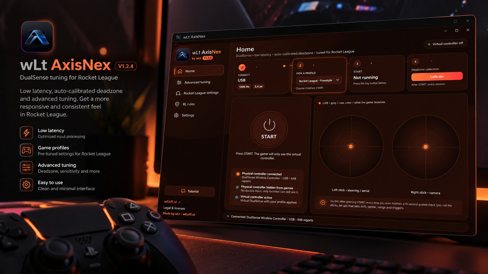
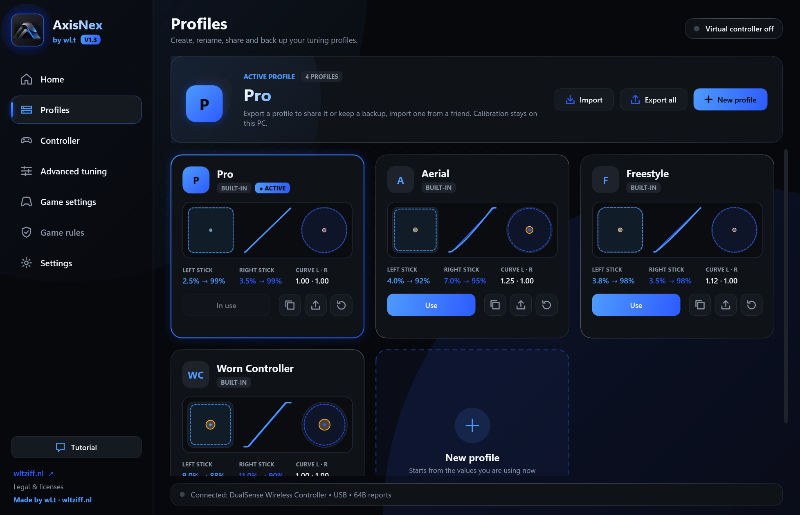
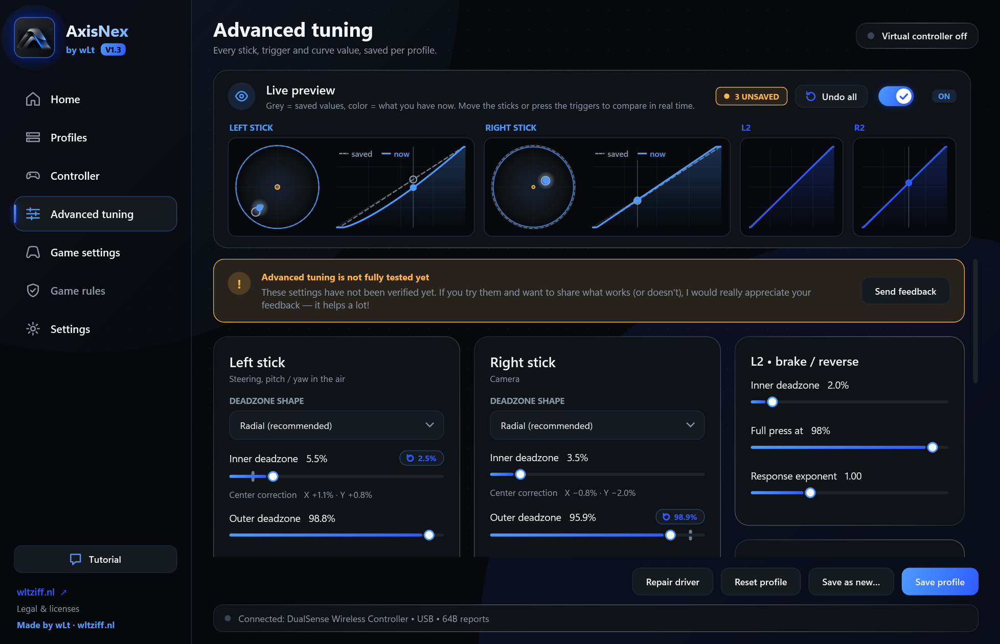
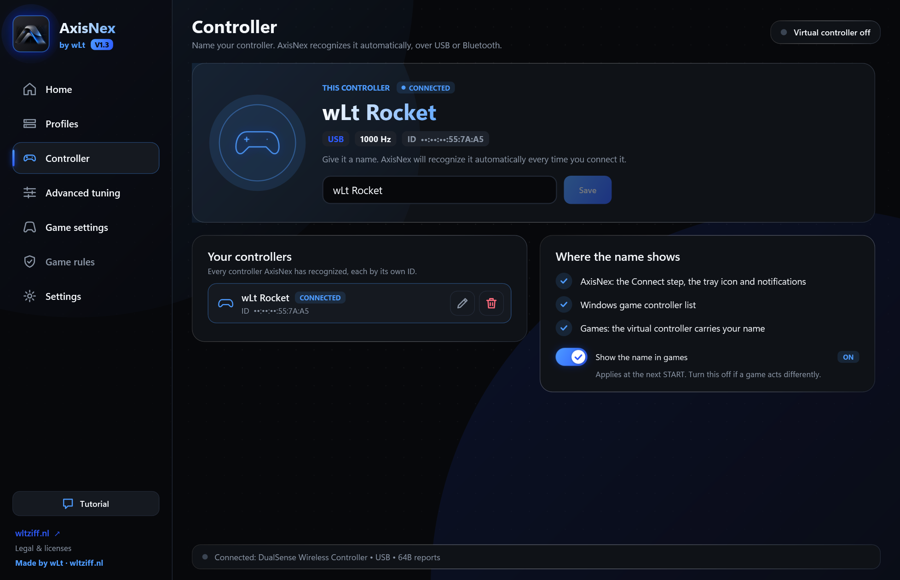
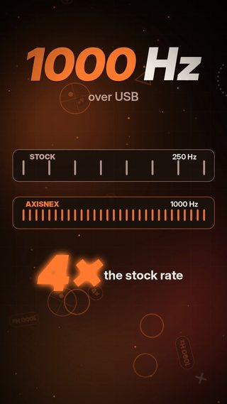
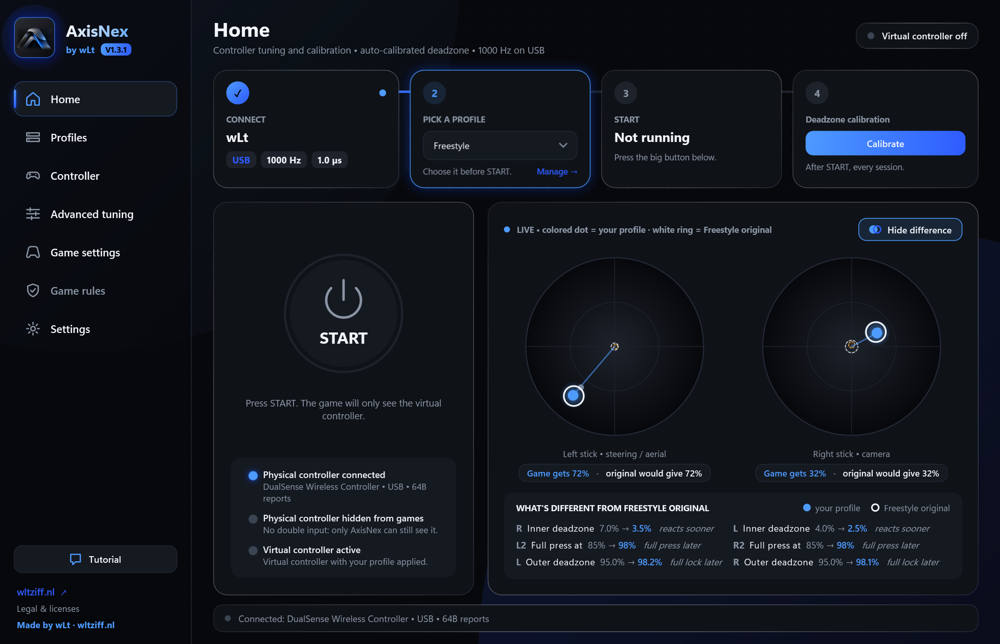

Limbă: [English](../README.md) | Română

  

<h1 align="center">AxisNex</h1>

  <b>Reglare și calibrare controller pentru Windows.</b> 
  Reglează fin deadzone-urile, răspunsul și profilurile controllerului. 
  de <b>wLt</b> · <a href="https://wltziff.nl">wltziff.nl</a>

> **AxisNex este un proiect independent și nu este afiliat, susținut sau sponsorizat de Sony Interactive Entertainment, Epic Games, Psyonix sau de vreun producător de controllere ori de jocuri. Toate mărcile comerciale aparțin proprietarilor lor.**

  <a href="https://github.com/wlt1920/AxisNex/releases/latest"><b>⬇ Descarcă ultima versiune</b></a> · <a href="../CHANGELOG.md"><b>Ce e nou în fiecare update</b></a> (în engleză)

  

  
  
  

## Ce e nou în V1.3

<table>
  <tr>
    <td width="50%" valign="top"> <b>Profilurile tale.</b> Creezi, copiezi și redenumești profiluri și le exporți într-un fișier ca să le dai prietenilor sau să ai backup.</td>
    <td width="50%" valign="top"> <b>Vezi diferența.</b> Cercul alb arată unde ar ajunge stick-ul cu valorile originale, live, plus o listă în cuvinte simple cu ce s-a schimbat.</td>
  </tr>
  <tr>
    <td width="50%" valign="top"> <b>Înainte și după, live.</b> Advanced tuning arată valorile salvate față de cele noi în timp real, cu reset pe fiecare valoare.</td>
    <td width="50%" valign="top"> <b>Numele controllerului.</b> AxisNex îl recunoaște automat, pe USB sau Bluetooth, și îl salută pe nume.</td>
  </tr>
</table>

Tot nou: **✕ lasă AxisNex pornit lângă ceas** (click dreapta → Ieșire ca să-l închizi), un mesaj roșu clar sub START când controllerul nu e conectat, o animație de bun venit și reparația pentru meniurile Windows care făceau scroll singure.

   
  <b>▶ <a href="AxisNex-promo.mp4">AxisNex în 50 de secunde</a></b> (video, cu sunet)

---

AxisNex citește controllerul tău fizic, aplică setările tale de deadzone, răspuns și triggere și le dă jocurilor un singur controller virtual cu aceste setări. Cât timp AxisNex rulează, controllerul fizic e ascuns de jocuri, așa că jocul nu vede două controllere.

AxisNex este gratuit. Nu modifică jocurile și nu rulează în interiorul lor.

**La ce te ajută**

- **Drift și stick-uri care nu stau fix în centru.** Calibrarea măsoară cât se mișcă singur fiecare stick și unde se oprește, corectează centrul și setează cel mai mic deadzone care acoperă drift-ul — în loc să ghicești unul mare.
- **Stick-uri sau triggere uzate care nu mai ajung la 100%.** Calibrarea măsoară cât de departe ajunge fiecare direcție și fiecare trigger, ca să obții tot output-ul.
- **Input inconsecvent și deadzone-uri adunate.** Deadzone, curbă de răspuns și triggere într-un singur loc, plus valori recomandate în joc, ca deadzone-ul jocului să nu se adune peste cel din AxisNex.
- **Rocket League pe PC cu un DualSense.** Profilurile incluse și pagina Setări joc sunt făcute cu Rocket League în minte; reglajul de deadzone și calibrarea în sine nu depind de joc.

## Funcții

  

- **Un singur controller în joc.** Controllerul fizic e ascuns de jocuri cu [HidHide](https://github.com/nefarius/HidHide), iar un controller virtual ([HIDMaestro](https://github.com/hifihedgehog/HIDMaestro)) primește inputul reglat de tine. Când oprești AxisNex, controllerul fizic devine din nou vizibil.
- **Calibrare ghidată (cam 15 secunde).** Stai nemișcat, rotește ambele stick-uri pe margine, dă drumul. AxisNex măsoară drift-ul în repaus, centrul fiecărui stick, cât de departe ajunge fiecare stick și ambele triggere, apoi propune cel mai mic deadzone care acoperă drift-ul măsurat. Vezi rezultatul înainte să se salveze ceva.
- **Reglaj manual.** Forma deadzone-ului (radial, axial, hibrid, pătrat), deadzone interior și exterior, anti-deadzone, curba de răspuns, sensibilitate, smoothing, stabilitate pe diagonală, ieșire pătrată, plus intervalul și curba triggerelor.
- **4 profiluri incluse:** Pro, Freestyle, Aerial și Worn Controller. Calibrarea și modificările se salvează în profilul activ; orice profil inclus poate fi readus la valorile originale.
- **Interogare USB la 1000 Hz.** Pe cablu USB, AxisNex poate schimba intervalul de interogare al controllerului de la 4 ms (250 Hz, implicit) la 1 ms (1000 Hz), cu driverul [hidusbf](https://github.com/LordOfMice/hidusbf) de la SweetLow, semnat de Microsoft. Se poate opri și e scos de pe controller la dezinstalare. Asta schimbă cât de des citește Windows controllerul; pe Bluetooth nu e posibil. Rata de input în timp real apare pe pagina Acasă.
- **Pagina Setări joc**, cu valorile recomandate în joc, ca deadzone-ul jocului să nu se adune peste cel din AxisNex.
- **Pagina Reguli joc** (opțională), care urmărește schimbările din regulile de fair-play ale publisherului și arată știrile oficiale și discuțiile jucătorilor despre anti-cheat.
- **11 limbi** (English, Română, Deutsch, Español, Français, Italiano, Português, Nederlands, Polski, Türkçe, Русский) și 9 teme de culori.
- **Update-uri integrate.** AxisNex poate verifica pe GitHub dacă există o versiune nouă, îți arată noutățile, descarcă installerul, îi verifică SHA-256 și îl instalează. Verificarea automată poate fi oprită.

**Reglajul avansat nu e încă testat complet.** Dacă îl încerci, orice [feedback](https://github.com/wlt1920/AxisNex/issues/new) e binevenit.

## Cerințe

- Windows 10 sau Windows 11, pe 64 de biți.
- Drepturi de administrator (pentru instalare și drivere, vezi [Securitate](#securitate)).
- Un controller compatibil: momentan **DualSense Wireless Controller**, conectat prin cablu USB sau Bluetooth. Alte controllere nu sunt încă suportate.
- Pentru 1000 Hz: un cablu USB **de date** (cablurile doar de încărcare nu merg).
- Conexiune la internet doar pentru verificarea opțională a update-urilor și pagina Reguli joc.

## Instalare

> [!IMPORTANT]
> **Repornește Windows după prima instalare a AxisNex.**
> Driverele pentru controllerul virtual și pentru ascunderea controllerului fizic se încarcă doar după o repornire.

1. Descarcă ultimul **`AxisNex-…-Setup.exe`** de pe [Releases](https://github.com/wlt1920/AxisNex/releases/latest). Descărcările oficiale sunt **doar** pe această pagină GitHub și pe [wltziff.nl](https://wltziff.nl).
2. Opțional: compară SHA-256 al installerului cu valoarea din notele versiunii (PowerShell: `Get-FileHash .\AxisNex-…-Setup.exe`).
3. Pornește installerul și confirmă cererea de administrator din Windows. Installerul nu e semnat digital, așa că Windows SmartScreen poate afișa „Editor necunoscut”.
4. Alege limba și acceptă licența.
5. Installerul instalează AxisNex, [HidHide](https://github.com/nefarius/HidHide) (dacă nu e deja instalat), driverul pentru controllerul virtual și driverul pentru 1000 Hz pe USB.
6. Pe ultima pagină apare **Repornire necesară**. Alege **Repornește acum** și apasă *Finalizare*, sau alege **Repornește mai târziu** și repornește înainte să folosești AxisNex.
   Dacă deschizi AxisNex înainte să repornești, apare **Repornire recomandată**, o dată pe sesiune Windows, până repornești.

Update-urile instalate din aplicație îți păstrează profilurile, calibrarea și setările.

## Primii pași

1. Conectează controllerul prin cablu USB (recomandat pentru 1000 Hz) sau prin Bluetooth.
2. Deschide AxisNex. Prima dată, un tutorial scurt îți explică ecranul (îl poți relua cu butonul **Tutorial**).
3. Pe **Acasă**, alege un profil (pasul 2). **Pro** e selectat implicit.
4. Apasă **START**. AxisNex ascunde controllerul fizic și pornește controllerul virtual; toate cele trei puncte de stare devin verzi.
5. Apasă **Calibrează** și urmează cei trei pași scurți. Fă asta după START, de fiecare dată când deschizi AxisNex, și din nou după ce schimbi profilul.
6. Pornește jocul **după** ce apeși START. Dacă jocul era deja deschis, repornește-l.
7. Opțional: deschide **Setări joc** ca să vezi ce setări să folosești în joc, ca deadzone-urile să nu se adune. Dacă jocul rulează prin Steam, lasă Steam Input pornit.

Apasă din nou START (sau închide AxisNex) ca să oprești; controllerul fizic devine din nou vizibil pentru jocuri.

## Detectarea controllerului

- AxisNex caută **DualSense Wireless Controller** după ID-ul USB de producător și de produs (`054C:0CE6`), pe USB și pe Bluetooth. Bara de stare arată numele dispozitivului și tipul conexiunii, așa cum le raportează Windows.
- Dispozitivele virtuale sau create din software sunt ignorate, deci AxisNex nu își preia niciodată propriul controller virtual.
- AxisNex caută controllerul cam la fiecare 1,5 secunde, așa că îl detectează automat când îl conectezi sau îl reconectezi.
- Cât timp AxisNex rulează, controllerul fizic e ascuns de alte programe cu HidHide; doar AxisNex îl poate citi. Dacă AxisNex se închide neașteptat, controllerul devine din nou vizibil la următoarea pornire a AxisNex.
- Interogarea la 1000 Hz se aplică doar pe USB. Pe Bluetooth, controllerul folosește propria rată de raportare.

## Calibrare și profiluri

Calibrarea are trei pași — **Repaus** (nu atinge nimic), **Cursă** (rotește ambele stick-uri pe margine și apasă o dată complet ambele triggere) și **Revenire** (dă drumul) — urmați de un ecran cu rezultatul. Nimic nu se salvează până nu apeși **Aplică și salvează**. Fiecare profil (**Pro**, **Freestyle**, **Aerial**, **Worn Controller**) are propriile deadzone-uri, așa că recalibrează după ce schimbi profilul.

Ghid detaliat (în engleză): [calibration.md](calibration.md).

## Limitări cunoscute

- E suportat doar **DualSense Wireless Controller**, câte unul o dată.
- Cele patru profiluri incluse pot fi modificate și resetate, dar încă nu poți crea profiluri noi.
- Pagina **Reglaj avansat** nu e încă testată complet.
- Installerul și aplicația nu sunt semnate digital.

## Depanare

### Controllerul nu este detectat

1. Repornește Windows (obligatoriu după prima instalare).
2. Reconectează controllerul: scoate și pune la loc cablul USB sau reconectează-l prin Bluetooth.
3. Folosește de preferat o conexiune USB pe fir, cu un cablu care transmite date (nu unul doar de încărcare).
4. Pornește din nou AxisNex.

### „Am găsit controllerul, dar nu îl pot deschide”

Alt program pentru controller îl folosește. Închide-l și apasă din nou START.

### Jocul vede două controllere

- Verifică dacă **Ascunde controller-ul fizic (HidHide)** e pornit în Setări.
- Pornește jocul **după** ce apeși START sau repornește-l.
- Dacă AxisNex spune că lipsește HidHide, reinstalează AxisNex (installerul include HidHide), apoi repornește Windows.

### 1000 Hz nu pornește

Merge doar pe cablu USB. Dacă Windows nu acceptă driverul, AxisNex readuce singur controllerul la 250 Hz și afișează un mesaj. Reinstalarea AxisNex adaugă din nou driverul.

### „Anti-cheat violation detected” sau ești dat afară dintr-un meci

Apasă STOP în AxisNex și joacă o vreme fără el. Vezi pagina **Reguli joc** și secțiunea [Declinarea răspunderii](#declinarea-răspunderii).

## Confidențialitate

Informațiile de aici se bazează pe codul sursă al AxisNex:

- AxisNex **nu are telemetrie, analiză, reclame sau conturi**. Nu trimite nicăieri informații despre tine, PC-ul sau controllerul tău.
- Setările, profilurile și calibrarea sunt salvate local pe PC (în folderul AppData al utilizatorului și în registry-ul Windows).
- AxisNex se conectează la internet doar pentru:
  - **Verificarea update-urilor** (pornită implicit, se poate opri din Setări): descarcă `version.json` din ultimul release GitHub al acestui repository; când alegi să faci update, descarcă installerul de pe GitHub.
  - **Pagina Reguli joc** (pornită implicit, se poate opri din acea pagină): la pornire și la fiecare 6 ore cât AxisNex e deschis, citește pagini publice: termenii și condițiile Epic Games, știrile jocului pe Steam și o căutare pe forumul comunității Steam al jocului.
  - **Linkurile pe care dai click**, care se deschid în browserul tău.
- Ca la orice vizită pe un site, aceste servere (GitHub, Epic Games, Valve/Steam) văd adresa ta IP și un User-Agent cu versiunea AxisNex. wLt nu primește nimic din toate acestea.

## Securitate

- **Drepturi de administrator.** Installerul are nevoie de ele ca să instaleze în Program Files și să instaleze trei drivere: HidHide (ascunde controllerul fizic), driverul HIDMaestro pentru controllerul virtual și hidusbf (1000 Hz pe USB). Și AxisNex rulează ca administrator, pentru că ascunderea controllerului, crearea controllerului virtual și schimbarea ratei de interogare USB sunt operații permise în Windows doar administratorilor.
- **Certificatul driverului.** HIDMaestro își instalează propriul certificat de driver auto-semnat (`HIDMaestroTestCert`) în depozitele de certificate de încredere ale calculatorului, ca driverul lui user-mode să se poată încărca. Rămâne instalat după dezinstalarea AxisNex și poate fi șters cu `certlm.msc`.
- **Update-urile** sunt acceptate doar din release-urile GitHub ale acestui repository, prin HTTPS. Installerul se descarcă în folderul programului AxisNex (în care pot scrie doar administratorii), e verificat cu SHA-256 din manifestul release-ului și abia apoi e pornit.
- **Componentele incluse** (installerul HidHide, driverul hidusbf, biblioteca HIDMaestro) sunt release-uri oficiale, iar hash-urile lor SHA-256 sunt verificate când se construiește AxisNex.
- AxisNex **nu este semnat digital**. Verifică descărcările cu SHA-256 din notele versiunii.
- AxisNex nu îți cere niciodată să dezactivezi Windows Defender, antivirusul, Secure Boot, verificarea semnăturii driverelor sau orice altă protecție Windows.
- AxisNex nu injectează cod în jocuri, nu citește memoria jocurilor și nu modifică fișierele jocurilor.

Scanări ale fișierelor terțe incluse:

| Fișier | SHA-256 | Scanare |
|---|---|---|
| `hidusbf.sys` (driver USB 1000 Hz de la SweetLow, semnat de Microsoft) | `2f82cdeb36bdaa42ea1933a9b11f3b8e1bdb28e6d3e3da7e65b4631b3375412d` | [VirusTotal](https://www.virustotal.com/gui/file/2f82cdeb36bdaa42ea1933a9b11f3b8e1bdb28e6d3e3da7e65b4631b3375412d) |
| `HidHide_x64.exe` (installerul oficial Nefarius v1.5.230) | `f4bbbcb82e6258641b887c74bc81c4c5f66e4aa811808dfc304347687b7605f6` | [VirusTotal](https://www.virustotal.com/gui/file/f4bbbcb82e6258641b887c74bc81c4c5f66e4aa811808dfc304347687b7605f6) |

Nu ești sigur? Nu trebuie să ne crezi pe cuvânt: scanează singur installerul cu orice antivirus sau scanner online, compară SHA-256 sau pur și simplu nu-l instala.

**Atenție la țepe:** AxisNex este gratuit. wLt nu îți cere niciodată bani, date de logare, parole sau contul de joc. Copiile de pe alte site-uri, din videoclipuri sau fișiere de pe Discord nu sunt de la wLt.

Ai găsit o problemă de securitate? Vezi [SECURITY.md](../SECURITY.md) (în engleză). Pentru bug-uri și idei folosește [șabloanele de issue](https://github.com/wlt1920/AxisNex/issues/new/choose).

## Declinarea răspunderii

**AxisNex este un proiect independent și nu este afiliat, susținut sau sponsorizat de Sony Interactive Entertainment, Epic Games, Psyonix sau de vreun producător de controllere ori de jocuri. Toate mărcile comerciale aparțin proprietarilor lor.**

Numele de produse și jocuri sunt folosite doar pentru a descrie hardware-ul compatibil și sursele la care se referă AxisNex. Instalezi și folosești AxisNex pe propriul risc și ești responsabil să respecți regulile fiecărui joc și ale fiecărei platforme cu care îl folosești. Nimeni nu poate garanta cum tratează un sistem anti-cheat un program terț pentru controller. Vezi [licența](../legal/EULA-ro.txt).

## Licență

AxisNex este **software proprietar gratuit**, nu open source. © 2026 wLt. Toate drepturile rezervate. Îl poți descărca și folosi gratuit conform [contractului de licență](../legal/EULA-ro.txt) afișat la instalare ([English](../legal/EULA-en.txt), [Deutsch](../legal/EULA-de.txt)). Installerul original, nemodificat, poate fi distribuit gratuit; vânzarea lui sau publicarea unor versiuni modificate nu este permisă.

Componentele terțe își păstrează propriile licențe: [`THIRD-PARTY-NOTICES.txt`](../THIRD-PARTY-NOTICES.txt).

## Credite

Creat de **wLt** ([wltziff.nl](https://wltziff.nl)), cu cunoștințele mele de bază de C#, împreună cu instrumentele AI Claude și Codex.

AxisNex se bazează pe aceste proiecte open-source — mulțumesc:

| Componentă | Pentru ce | GitHub | Licență |
|---|---|---|---|
| HIDMaestro | driver pentru controllerul virtual (UMDF2) | [hifihedgehog/HIDMaestro](https://github.com/hifihedgehog/HIDMaestro) | MIT |
| HidHide de la Nefarius | ascunde controllerul fizic de jocuri | [nefarius/HidHide](https://github.com/nefarius/HidHide) | MIT |
| HidSharp | citirea controllerului prin HID | [IntergatedCircuits/HidSharp](https://github.com/IntergatedCircuits/HidSharp) | Apache 2.0 |
| hidusbf de la SweetLow | interogare USB la 1000 Hz (driver NoPatch, semnat de Microsoft) | [LordOfMice/hidusbf](https://github.com/LordOfMice/hidusbf) | Domeniu public |
| usbip-win2 (în HIDMaestro) | transport USB pentru dispozitive compuse | [vadimgrn/usbip-win2](https://github.com/vadimgrn/usbip-win2) | BSD 2-Clause |
| DsHidMini de la Nefarius (abordare și părți folosite de HIDMaestro) | baza driverului user-mode pentru controller | [nefarius/DsHidMini](https://github.com/nefarius/DsHidMini) | BSD 3-Clause |
| .NET Runtime | runtime | [dotnet/runtime](https://github.com/dotnet/runtime) | MIT |
| WPF | interfața | [dotnet/wpf](https://github.com/dotnet/wpf) | MIT |
| Inno Setup | installer | [jrsoftware/issrc](https://github.com/jrsoftware/issrc) | Inno Setup License |
